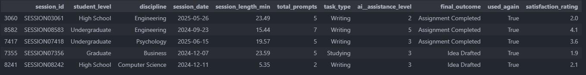
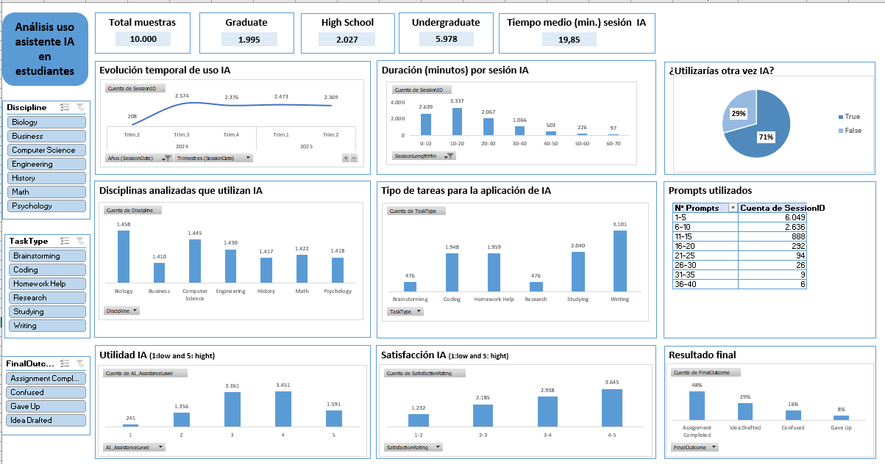

# AI Assistant Usage in student life #

## **¿Qué es este datasheet?**##
Son las datos recogidos de como los estudiantes de diferentes grados utilizan un asistente IA para realizar las tareas académicas. 
Cada fila es una sesión única en la cual se muestra el nivel del estudiante, la disciplina, el tipo de tarea para la que se utiliza la IA, la duración de la sesión, la eficacia, el grado de satisfacción y se han vuelto a utilizar la herramienta IA.

## **¿Cómo está estructurado este datasheet?**##
El tamaño de este datasheet es de 10.000 filas y 11 columnas. A continuación detallo el nombre de las columnas:
- **SessionID:** Identificador único de la sesión
- **StudentLevel:** Nivel académico del estudiante (puede ser "High School", "Undergraduate" y "Graduate")
- **Discipline:** Especialidad del estudiante 
- **SessionDate:** Fecha de la sesión
- **SessionLengthMin:**	Duración de la sesión IA (en minutos)
- **TotalPrompts:**	Número de prompts o mensajes que se han utilizado en la sesión
- **TaskType:**	Naturaleza de la tarea (escritura, codificación...)
- **AI_AssistanceLevel:** Escala 1–5 para la percepción de la ayuda (1 es bajo y 5 es alto)
- **FinalOutcome:**	Objetivo del estudiante
- **UsedAgain:** Se ha vuelto a utilizar la IA.
- **SatisfactionRating:** Escala 1–5 del grado de satisfacción general (1 es bajo y 5 es alto)

## **Trabajos realizados** ##
En el archivo excel, he creado un dashboard tal y como se ha indicado en el módulo 3.Dashboard & análisis de datos. También he trabajo los datos con Python (tal y como se puede ver en el archivo GitHub).
En excel, hemos realizado tablas y gráficos dinámicos para así ver la relación entre el grado del estudiante y la finalidad de la utilización de la IA y el resultado obtenido. 

## **Conclusiones** ##
Una vez analizados los resultados, podemos decir que:
- El 60% de los estudiantes que utilizan herramientas IA son licenciados y el resto, se dividen a partes iguales entre los estudiantes de bachillerato (20%) y los estudiantes de postgrado (20%).
- El tiempo medio por sesión de IA es de unos 20minutos.
- En el 60% de las sesiones, se utilizan entre 1 y 5 prompts, seguido de un 20% que utiliza entre 5 y 10 prompts.
- En cuanto a las disciplinas, no hay una disciplina que destaque por encima de la otra, ya que el porcentaje de utilización de herramientas IA es igual para todas, que es un más menos 14%.
- Con respecto a la satisfacción de la herramienta IA, un 36% considera satisfactorio la herramienta por un 12% que considera que no es satisfactorio.
- El 71% de los estudiantes volvería a utilizar la herramienta de IA para sus estudios.  

